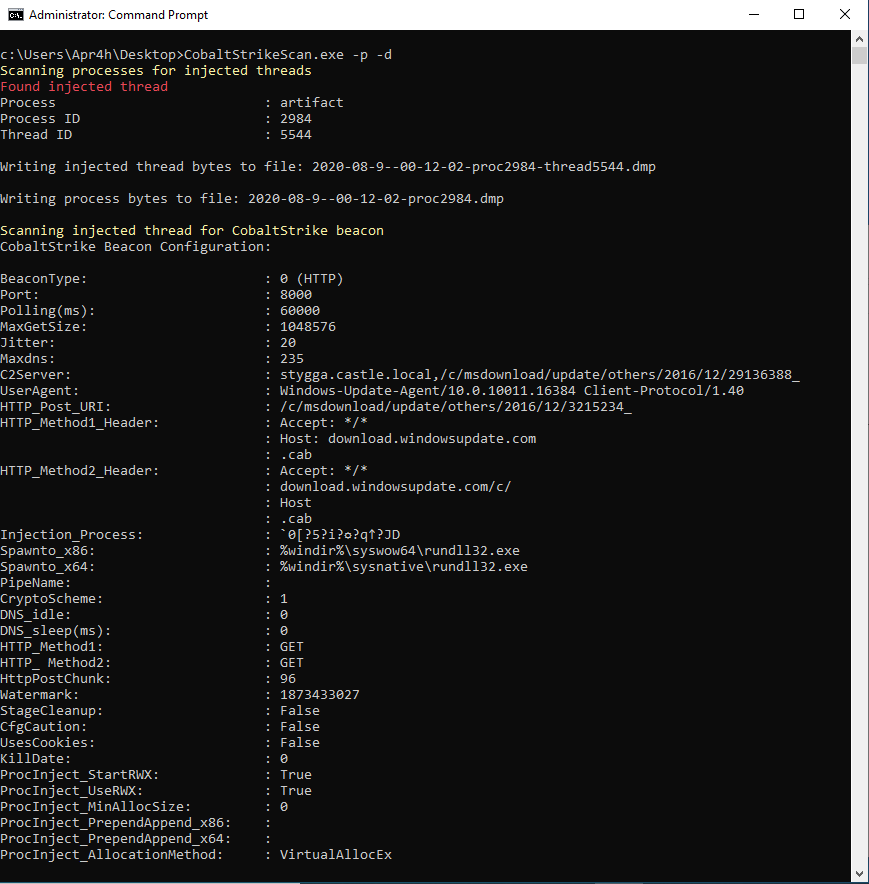

# CobaltStrikeScan
Scan files or process memory for Cobalt Strike beacons and parse their configuration.

CobaltStrikeScan scans Windows process memory for evidence of DLL injection (classic or reflective injection) and performs a YARA scan on the target process' memory for Cobalt Strike v3 and v4 beacon signatures. 

Alternatively, CobaltStrikeScan can perform the same YARA scan on a file supplied by absolute or relative path as a command-line argument.

If a Cobalt Strike beacon is detected in the file or process, the beacon's configuration will be parsed and displayed to the console.

## Acknowledgements
This project is inspired by the following research / articles:
- [SpecterOps - Defenders Think in Graphs Too](https://posts.specterops.io/defenders-think-in-graphs-too-part-1-572524c71e91)
- [JPCert'sVolatility Plugin for Detecting Cobalt Strike](https://blogs.jpcert.or.jp/en/2018/08/volatility-plugin-for-detecting-cobalt-strike-beacon.html)
- [SentinelLabs - The Anatomy of an APT Attack and CobaltStrike Beacon’s Encoded Configuration](https://labs.sentinelone.com/the-anatomy-of-an-apt-attack-and-cobaltstrike-beacons-encoded-configuration)

## Requirements
- 64-bit Windows OS
- .NET Framework 4.6
- Administrator or SeDebugPrivilege is required to scan process memory for injected threads

## Usage
```
  -d, --dump-processes      Dump process memory to file when injected threads are detected

  -f, --scan-file           Scan a file/process dump for CobaltStrike beacons

  -i, --injected-threads    Scan running (64-bit) processes for injected threads (won't scan for CobaltStrike beacons)

  -p, --scan-processes      Scan running processes for injected threads and CobaltStrike beacons

  -v, --verbose             Write verbose output (display detailed information for injected threads)

  -h, --help                Display Help Message

  --help                    Display this help screen.

  --version                 Display version information.
```

## Example

